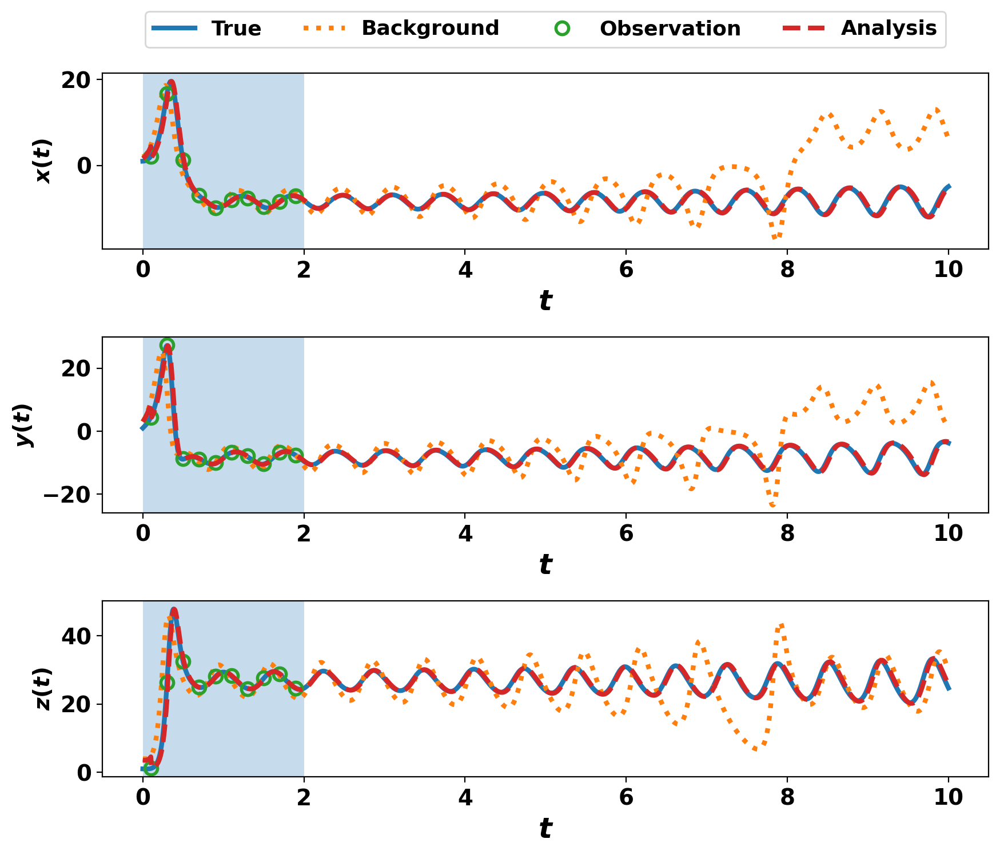

# ICESEE

ICESEE (ICE ShEet State and Parameter Estimator) is a data assimilation software framework designed for coupling with ice-sheet, climate, and geophysical models such as ISSM, Icepack, and idealized models such as Lorenz-96. It provides a modular and extensible platform for ensemble forecasting, state estimation, parameter estimation, and uncertainty quantification across a wide range of scientific modeling applications.

---

## What is ICESEE?

ICESEE is a scalable ensemble-based data assimilation framework designed for coupling with numerical models ranging from idealized dynamical systems to large-scale ice-sheet and Earth-system models.

The framework provides a scientific computing infrastructure for:

- Ensemble forecasting
- State estimation
- Parameter estimation
- Uncertainty quantification
- Distributed-memory HPC execution
- Scientific workflow automation
- Cross-language model coupling

ICESEE supports both research and production-scale workflows through modular data assimilation components, flexible model interfaces, and scalable HPC execution.

---

## Getting Started

To get started with ICESEE:

- Installation Guide
- Using ICESEE
- Build ICESEE as a Package
- Developmental Notes

### Related Projects

| Project | Description |
|----------|-------------|
| ICESEE-Spack | HPC and cluster deployment |
| ICESEE-Containers | Containerized execution environments |
| ICESEE-GHUB | Cloud and browser-based scientific workflows |

> For cluster installations and large-scale production runs, see ICESEE-Spack and ICESEE-Containers. For cloud-based and interactive deployments, see ICESEE-GHUB.

---

## Supported Models

- icepack: PDE-based ice-sheet modeling with Firedrake
- issm: Finite-element ice-sheet modeling via MATLAB coupling
- lorenz96: Idealized nonlinear data assimilation benchmark
- flowline_model: Simple ice-flow simulation

---

## Documentation

Explore the Wiki to find:

- Configuration and setup tips
- Model implementation guides
- Filter development and customization
- Data assimilation workflows
- Debugging and troubleshooting guides
- HPC deployment recommendations

---

## Key Features

- Modular ensemble-based data assimilation framework
- State and parameter estimation capabilities
- Cross-language scientific model coupling
- Scalable HPC and distributed-memory workflows
- HDF5/NetCDF-based scientific data pipelines
- Containerized and cloud-enabled execution
- Extensible APIs for integrating external models
- Support for uncertainty quantification and ensemble forecasting
- Reproducible scientific computing infrastructure

---

## AI/ML Integration

ICESEE is being extended with scientific machine learning and AI-assisted workflows to support next-generation data assimilation and computational modeling capabilities.

Current research and development efforts include:

- Machine learning–based parameter estimation
- Neural-network observation operators
- AI-enhanced ensemble initialization
- Adaptive covariance and inflation tuning
- Surrogate forward models for accelerated simulations
- Intelligent workflow automation and HPC optimization
- AI-assisted diagnostics and parameter tuning

These capabilities are under active development and are not yet part of the stable ICESEE release.

---

## Future Directions

- Integration of scientific machine learning workflows into data assimilation pipelines
- Development of neural surrogate models for accelerated ice-sheet simulations
- AI-assisted parameter estimation and adaptive ensemble tuning
- Integration with cloud-native scientific computing environments
- Expansion of distributed HPC workflows for large-scale ensemble forecasting
- Continued development of the ICESEE-GHUB ecosystem
- Intelligent workflow orchestration and automated diagnostics

---

## Contributing

Contributions are welcome. Please open an issue or submit a pull request through the GitHub repository.

For questions, suggestions, or collaboration opportunities:

Brian Kyanjo  
bkyanjo3@gatech.edu

---

## License

ICESEE is distributed as free and open-source software under the BSD 2-Clause License (see LICENSE).

External software packages and coupled models, including ISSM, Icepack, Firedrake, MATLAB-based components, and other third-party dependencies, remain subject to their respective licenses, which are independent of the ICESEE license.

--- 

## ICESEE CI Lorenz96 smoke test

The figure shown below is generated directly from the automated test workflow of Lorenz96 and serves as a lightweight end-to-end verification of the framework.

**Figure:** Automatically generated by the ICESEE CI workflow after executing the Lorenz-96 assimilation benchmark. The figure compares the true trajectory, background forecast, synthetic observations, and ensemble analysis produced by ICESEE.
